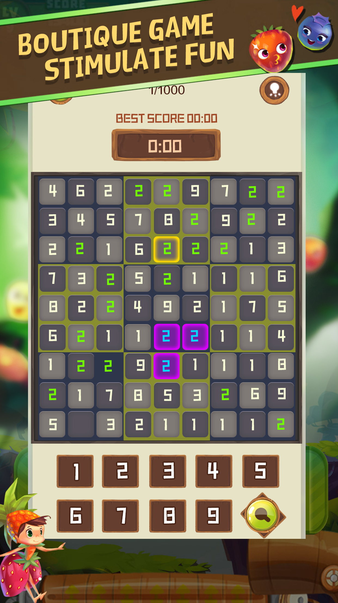

Sudoku is an 18th century Swiss math game. This is a logic game that uses paper and pen to calculate. The player needs to infer the amount of all remaining space based on the known number on the 9x9 panel, and satisfy each row, the number of each column and each thick line (3 * 3) is 1-9 instead of repeating. . Win all the conditions and unlock the next level!

Sudoku Master-Happy Sudoku has beautiful pictures, beautiful background music, smooth game experience, waiting for your experience! !

email:mvnbcv@yandex.com

telephone number:+86 155 7281 9237